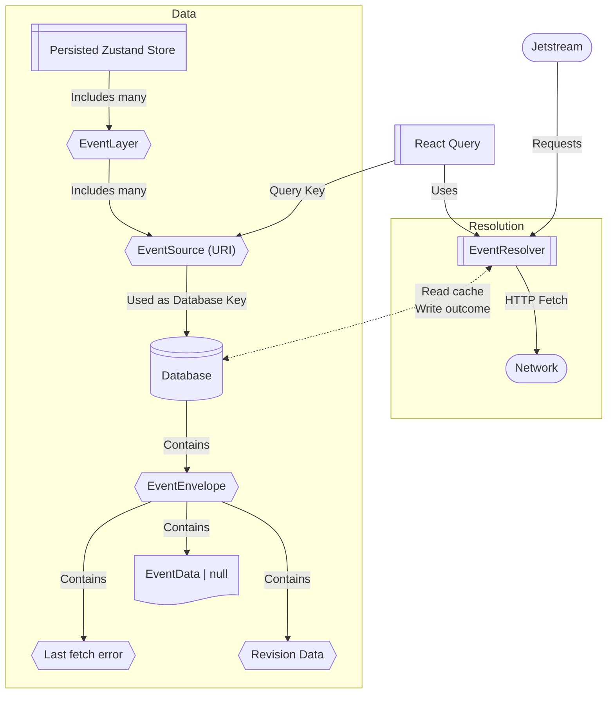

# Vantage

A reference web application for viewing events.

This application is built using React, Mantine, Zustand, Jotai, Tanstack Query and Router.

## For Developers

Special pages exist:

- `/embed` - iframe embeddable event card information.
  
  You must supply one of the following query parameters:
  - `source`: [EventSource](../../docs/SOURCE.md)
  - `event-data`: JSON string of [EventData](../../docs/DATA.md)

- `/form` - render an event data editing form
  
  Query parameters:
  - `source`: [EventSource](../../docs/SOURCE.md) (data to edit)
  - `data`: JSON string of [EventData](../../docs/DATA.md) (data to edit)
  - `redirect-to`: URL to redirect to after form submission; query parameters will be appended with the updated event data, e.g. `?data=...`
  - `continue-text`: Text to show on the continue button (default: "Continue")
  - `title`: Title to show above the form (default: "Edit Event Data")
  - `desc`: Description to show above the form

## Diagram



## Development

- Go to [this link](https://event.nya.pub/?setInstanceUrl=http://127.0.0.1:5173) to set the instance URL for development 

```bash
cd apps/web
pnpm i
pnpm dev
```


