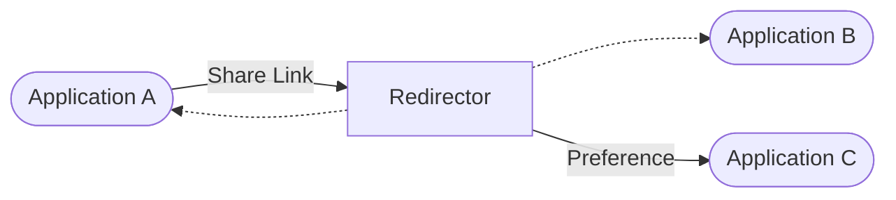

🔙 [@evnt Project](../README.md)

# Application Links Format

A link format is defined to allow applications to link to the redirector with specific actions to be performed. 

When sharing events with other users, applications should link to the redirector; the redirector will then forward the user to their preferred application to view the event.

If the user does not have a preferred application, a list of public applications ([data/instances.json](../data/instances.json)) are shown in the redirector.

Application Links use **URL search parameters** to define the action to be performed.

The operations are differentiated by the `action` parameter.

## `?action=view-event`
  
**Parameters:**
- `source`: [EventSource](./SOURCE.md) *used to be 'url'*

**Examples:**

- [Link to FOSDEM 2026](<https://event.nya.pub/?action=view-event&source=https%3A%2F%2Fdeniz.blue%2Fevents-data%2Fevents%2F2026%2Ffoss%2Ffosdem26.json>)

## `?action=view-index`

Views an `.index.json`.

**Parameters:**
- `index`: URL of the `.index.json` file

## Special Parameters

**Parameters:**

- `?setInstanceUrl=<url>` sets the instance url
- `?clearInstanceUrl` clears the instance url
- `?popup` to close the popup after operation

**Examples:**

- [Set Instance URL to 127.0.0.1:5173](https://event.nya.pub/?setInstanceUrl=http://127.0.0.1:5173/)
- [Clear Instance URL](https://event.nya.pub/?clearInstanceUrl)
