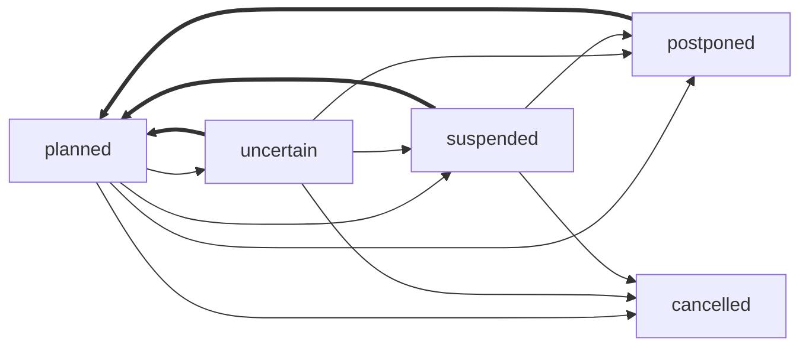

🔙 [@evnt Project](../README.md)

**Data Format Specification**

This document defines the data structures and types used for the @evnt Event format.

- [Types](#types)
	- [`Translations`](#translations)
	- [`PartialDate`](#partialdate)
	- [`EventStatus`](#eventstatus)
- [`EventData`](#eventdata)
	- [Venues](#venues)
		- [`Venue`](#venue)
		- [`PhysicalVenue`](#physicalvenue)
		- [`OnlineVenue`](#onlinevenue)
		- [`UnknownVenue`](#unknownvenue)
	- [Instances](#instances)
		- [`EventInstance`](#eventinstance)
	- [Components](#components)
		- [Type `EventComponent`](#type-eventcomponent)
		- [`LinkComponent`](#linkcomponent)

# Types

## `Translations`

`Translations` are defined as a json object where the keys are **BCP47**/**ISO 639-1** language codes and values are `string` values.

```ts
interface Translations {
  [language: string]: string;
}
```

```js
{ en: "Example", tr: "Örnek", lt: "Pavyzdys" }
```

Data consumers should try to use the user's language in the object and fall back (`undefined | ""`) to other values.

When creating or editing event data, applications **should not** use machine translation to fill in missing translations, but rather leave them empty and let users fill them in manually. Applications can use machine translations when displaying event details to users if they want to, but they should not modify the original data with machine translations.

## `PartialDate`

A `PartialDate` is defined as a **modified** [ISO 8601](https://en.wikipedia.org/wiki/ISO_8601) date and time string. The value does **not** include a timezone component and all values are **forced** to be in the **UTC timezone**.

This type allows us to define dates where we dont know enough information to define a full date. An event might be known to take place on April but the exact day might be unknown.

Atleast the year must be specified.

In order, the following components are allowed:
- Year (e.g. `2025`)
- Month (e.g. `2025-11`)
- Day (e.g. `2025-11-12`)
- Time (e.g. `2025-11-12T11:00`)

Examples:
- `2025`
- `2025-11`
- `2025-11-12`
- `2025-11-12T11:00`
- `2021-11-03T00:00`

⚠️ **Invalid** examples:
- `2025-11T12:00` (missing day)
- `2025-11-12T11:00Z` (includes timezone component)
- `2025-11-12T11:00+02:00` (includes timezone component)
- `2025-11-12T11:00:00` (includes seconds component)
- `2025-11-12T11` (missing minutes component)
- `2025-11-12T11:00:00.000` (includes milliseconds component)

## `EventStatus`

The `EventStatus` enum defines the possible schedule/planning state of an event instance or the whole event. This enum does not define the tense of the event (past, present, future) but rather the current state of the event planning or execution.

_Table of variants_:

| Variant     | Description                                                                           | Date Validity |
|-------------|---------------------------------------------------------------------------------------|---------------|
| `planned`   | Default state - event is planned to occur or has occurred as scheduled.               | ✅             |
| `uncertain` | Uncertain - event might get cancelled, postponed etc.                                 | ❓             |
| `postponed` | Postponed to a later, unknown date.                                                   | ❌             |
| `cancelled` | The event has been cancelled and will not take place.                                 | ❌             |
| `suspended` | No guarantees if the event will continue as planned, will get postponed or cancelled. | ❌             |

_Hellish Graph_:



# `EventData`

The main data structure representing an event is `EventData`.

```ts
{
	"v": 0,
	name: {
		en: "Example Event",
		lt: "Pavyzdys Renginys",
	},
}
```

Important fields:
- `v`: The version of the data format. Currently `0`.
- `name`: Required [`Translations`](#translations)
- `venues`: Array of [`Venue`](#venue)s.
- `instances`: Array of [`EventInstance`](#eventinstance)s.
- `components`: Array of [`EventComponent`](#eventcomponent)s.

Consumers should not use `venues` to display a list of venues for an event, but rather use the `venueIds` field in `EventInstance` objects to link them together (`Venue` has a `venueId` field). This allows us to:
- Represent instances where we dont know the venue of an event instance (empty `venueIds` array).
- Represent instances where an event takes place in multiple venues simultaneously or is a hybrid event (multiple `venueIds`).
- Avoid displaying venues that are not relevant to a specific event instance.

- **Venues** represent **where** an event takes place.
- **Instances** represent **when** an event takes place.
- **Components** represent **additional information** (not tied to a specific venue or instance) about an event.

See the [schema documentation](./SCHEMA.md#event-data-schema) for the full definition.

## Venues

### `Venue`

A `Venue` represents a location where an event takes place.

All venues have the following properties:
- `venueId`: A **unique** identifier for the venue. This is used to link the venue to `EventInstance` objects.
- `venueType`: The type of the venue, either `physical`, `online` or `unknown`.
- `venueName`: The name of the venue as a [`Translations`](#translations) object.

Types of venues:
- [`PhysicalVenue`](#physicalvenue): A real-world location where an event takes place.
- [`OnlineVenue`](#onlinevenue): An online location where an event takes place, such as a website or streaming platform.
- [`UnknownVenue`](#unknownvenue): None of the above

### `PhysicalVenue`

A [`PhysicalVenue`](./SCHEMA.md#physicalvenue) represents a real-world location where an event takes place.

This object includes:
- `address`: Optional physical address information.
- `coordinates`: Optional latitude and longitude coordinates.

_Examples_:

```ts
{
	venueId: "venue-1",
	venueType: "physical",
	venueName: { en: "Central Park", es: "Parque Central" },
	address: {
		addr: "Central Park West & 5th Ave, New York, NY 10024, USA",
		countryCode: "US",
	},
	coordinates: { lat: 40.785091, lng: -73.968285 },
}
```

### `OnlineVenue`

An [`OnlineVenue`](./SCHEMA.md#onlinevenue) represents an online location where an event takes place, such as a website or streaming platform.

This object includes:
- `url`: The URL where the event can be accessed.

_Examples_:

```ts
{
	venueId: "venue-2",
	venueType: "online",
	venueName: { en: "YouTube Live" },
	url: "https://www.youtube.com/live/example",
}
```

### `UnknownVenue`

An `UnknownVenue` represents a venue that is not known if it is online or physical.

This is primarily intended to be used for data scrapers when they know that an event has a venue but they cannot determine any information about it. This allows them to still link the event instance to a venue (using `venueId`) without having to provide any additional information.

## Instances

### `EventInstance`

An `EventInstance` represents a specific continuous occurrence of an event.

If an event has multiple occurrences (e.g., a conference with multiple days), each occurrence should be represented as a separate `EventInstance`.

If an event spans multiple days (such as a Game Jam or a Festival longer than 24 hours), it should be represented as a single `EventInstance` with a start and end date.

Required fields:
- `venueIds`: An array of `venueId`s linking this instance to one or more `Venue` objects. This field can be an empty array if the venue is not known.

Optional fields:
- `start`: A [`PartialDate`](#partialdate) representing the start date and/or time of the event instance
- `end`: A [`PartialDate`](#partialdate) representing the end date and/or time of the event instance
- `status`: An [`EventStatus`](#eventstatus) representing the current status of the event instance

_Examples_:

```ts
{
	venueIds: ["venue-1"],
	start: "2025-11-12T10:00",
	end: "2025-11-12T18:00",
}
```

## Components

### Type `EventComponent`

An `EventComponent` represents additional information about an event that is not tied to a specific venue or instance. This can be used to represent links, sources or any other relevant information about an event.

Each component has a `type` field that defines the type of the component and a `data` field that contains the relevant data for that type.

Table of component types:

| `type` | `data` type                     |
|--------|---------------------------------|
| `link` | [LinkComponent](#linkcomponent) |

### `LinkComponent`

A `LinkComponent` represents a link related to the event, such as a website, social media page, ticketing page etc.

Required fields:
- `url`: The URL of the link.

Optional fields:
- `name`: [`Translations`](#translations) representing the name of the link.
- `description`: [`Translations`](#translations) representing a description of the link.
- `disabled`: A boolean indicating whether the link is disabled. This can be used to represent links that are no longer valid or temporarily unavailable.
- `opensAt`: A [`PartialDate`](#partialdate) representing the date and/or time when the link becomes active or valid. This can be used for links that are not yet active but will become active in the future (e.g., a ticketing page that opens at a specific date and time).
- `closesAt`: A [`PartialDate`](#partialdate) representing the date and/or time when the link becomes inactive or invalid. This can be used for links that are only valid for a certain period of time (e.g., a form for registering to a competition that closes at a specific date and time).
