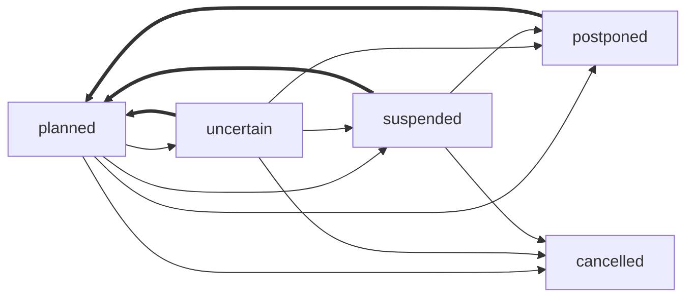

🔙 [@evnt Project](../README.md)

# Data Format Specification

This document defines the data structures and types used for the @evnt Event format.

## Definitions

### `Translations`

`Translations` are defined as a json object where the keys are **BCP47**/**ISO 639-1** language codes and values are `string` values.

```ts
interface Translations {
  [language: string]: string;
}
```

```js
{ en: "Example", tr: "Örnek", lt: "Pavyzdys" }
```

Data consumers should try to use the user's language in the object and fall back (`undefined | ""`) to other values.

### `PartialDate`

A `PartialDate` is defined as a modified [ISO 8601](https://en.wikipedia.org/wiki/ISO_8601) date and time string.
  
The value does not include a `Z` timezone component and all values are forced to be in **UTC** timezone.

The time part of the string is optional, if omitted, the `T` substring should not exist.

If there is no time specified, the date (day of the month) and month are also optional.

Examples:
- `2025`
- `2025-11`
- `2025-11-12`
- `2025-11-12T11:00`
- `2021-11-03T00:00`

This type allows us to define dates where we dont know enough information to define a full date. An event might be known to take place on April but the exact day might be unknown.

### `EventData`

The main data structure representing an event is `EventData`.

See the [schema documentation](./SCHEMA.md#event-data-schema) for the full definition.

An EventData object has a list of venues and instances. Data consumers should match instances to venues using the `venueId` field on instances - they shouldn't list venues without attaching them to instance information.

### `Venue`

A `Venue` is either a `PhysicalVenue` or an `OnlineVenue`. The type is defined using the `venueType` field: `"physical"` or `"online"`.

All venues has a `venueId` field which is referenced in `EventInstance` objects to link them together.

All venues have a `venueName` field which is of type `Translations`.

### `PhysicalVenue`

A [`PhysicalVenue`](./SCHEMA.md#physicalvenue) represents a real-world location where an event takes place.

This object includes:
- `address`: Optional physical address information.
- `coordinates`: Optional latitude and longitude coordinates.

_Examples_:

```ts
{
	venueId: "venue-1",
	venueType: "physical",
	venueName: { en: "Central Park", es: "Parque Central" },
	address: {
		addr: "Central Park West & 5th Ave, New York, NY 10024, USA",
		countryCode: "US",
	},
	coordinates: { lat: 40.785091, lng: -73.968285 },
}
```

### `OnlineVenue`

An [`OnlineVenue`](./SCHEMA.md#onlinevenue) represents an online location where an event takes place, such as a website or streaming platform.

This object includes:
- `url`: The URL where the event can be accessed.

_Examples_:

```ts
{
	venueId: "venue-2",
	venueType: "online",
	venueName: { en: "YouTube Live" },
	url: "https://www.youtube.com/live/example",
}
```

### `EventInstance`

An `EventInstance` represents a specific continuous occurrence of an event.

If an event has multiple occurrences (e.g., a conference with multiple days), each occurrence should be represented as a separate `EventInstance`.

If an event spans multiple days (such as a Game Jam or a Festival longer than 24 hours), it should be represented as a single `EventInstance` with a start and end date.

Every `EventInstance` has an array of `venueIds` to link it to one or more `Venue` objects. If an event takes place in multiple locations simultaneously (e.g., a hybrid event), all relevant venue IDs should be included. If an event instance's venue is not known, this field can be an empty array.

Every `EventInstance` has optional `start` and `end` fields of type `PartialDate` representing the start/end date and time of the event instance.

_Examples_:

```ts
{
	venueIds: ["venue-1"],
	start: "2025-11-12T10:00",
	end: "2025-11-12T18:00",
}
```

### `EventStatus`

The `EventStatus` enum defines the possible statuses of an event instance or the whole event. This enum does not define the tense of the event (past, present, future) but rather the current state of the event planning or execution.

_Table of variants_:

| Variant     | Description                                                                           | Date Validity |
|-------------|---------------------------------------------------------------------------------------|---------------|
| `planned`   | Default state - event is planned to occur or has occurred as scheduled.               | ✅             |
| `uncertain` | Uncertain - event might get cancelled, postponed etc.                                 | ❓             |
| `postponed` | Postponed to a later, unknown date.                                                   | ❌             |
| `cancelled` | The event has been cancelled and will not take place.                                 | ❌             |
| `suspended` | No guarantees if the event will continue as planned, will get postponed or cancelled. | ❌             |

_Hellish Graph_:


