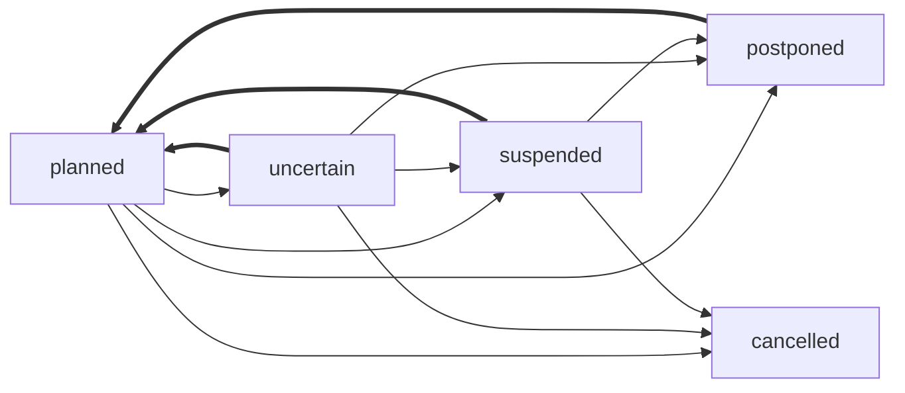

🔙 [@evnt Project](../README.md)

**Open Evnt Specification v 0.1**

This document defines the data structures and types used for [Open Evnt](https://evnt.directory).

The main data structure representing a single event is [`EventData`](#eventdata), which represents a single event. Event data **should** be represented as a JSON object.

The keywords **should**, **must**, **must not** and **may** in this document are to be interpreted as described in RFC 2119. However, for readability, these words do not appear in all uppercase letters in this specification.

See [Changelog](./CHANGELOG.md) for changes to the data format.

__Table of Contents__

- [Types](#types)
	- [`Translations`](#translations)
	- [`PartialDate`](#partialdate)
	- [`EventStatus`](#eventstatus)
	- [`Media`](#media)
		- [`MediaSource`](#mediasource)
- [`EventData`](#eventdata)
	- [Venues](#venues)
		- [`Venue`](#venue)
		- [`PhysicalVenue`](#physicalvenue)
		- [`OnlineVenue`](#onlinevenue)
		- [`UnknownVenue`](#unknownvenue)
	- [Instances](#instances)
		- [`EventInstance`](#eventinstance)
	- [Components](#components)
		- [Type `EventComponent`](#type-eventcomponent)
		- [`LinkComponent`](#linkcomponent)
		- [`SourceComponent`](#sourcecomponent)
		- [`SplashMediaComponent`](#splashmediacomponent)
		- [`app.bsky.richtext`](#appbskyrichtext)

# Types

## `Translations`

`Translations` are defined as a json object where the keys must be **BCP47/IETF language tags** and values must be `string` values.

```ts
interface Translations {
	[language: string]: string | undefined;
}
```

```js
{
	en: "Example",
	tr: "Örnek",
	lt: "Pavyzdys",
	"zh-Hans-CN": "示例",
}
```

Data consumers;
- **Should** try to use the user's language in the object and fall back to other languages if the user's language is not available.
- **May** display all available translations and let the user choose which one they want to see.
- **May** use machine translation to fill in missing translations, but they *should clearly indicate* that the translation is machine-generated and may not be accurate.

Data producers;
- **Should not** use machine translation to fill in missing translations.
- **Should** provide english translations *if possible*, as it is the most widely understood language and can serve as a common fallback for users who do not have translations in their preferred language.
- **Should** default to english if converting from a string value without a specified language, to avoid losing information.

__Resolution Algorithm:__

When trying to get a translation for a specific language, applications **may** follow this algorithm:

1. Exact match (e.g. `zh-Hans-CN`).
2. Without region subtag (e.g. `zh-Hans-CN` -> `zh-Hans`).
3. Only language subtag (e.g. `zh-Hans-CN` -> `zh`).
4. English (`en`).
5. Any available translation (e.g. the first one in the object).
6. Fallback string (e.g. an empty string or a placeholder text like "Translation not available").

## `PartialDate`

A `PartialDate` is a **string** representing a date and/or time with varying levels of precision. It is designed to allow for representing dates where not all components are known or relevant.

`PartialDate` is adapted from [RFC 9557](https://www.rfc-editor.org/rfc/rfc9557) (which is based on RFC 3339 and ISO 8601) but with some modifications to better suit our use case. A `PartialDate` is **not compatible** with RFC 3339 or ISO 8601.

A `PartialDate` can have four levels of precision: year, month, day and time. Each level of precision is optional, but they must be provided in order (i.e. you cannot have a day without a month or a month without a year).

A `PartialDate` **must** include an IANA Timezone identifier wrapped in square brackets at the end of the string to indicate the timezone of the date and time.

A `PartialDate` **must not** include an UTC offset (e.g. `Z` or `+02:00`) or a seconds component.

> [!WARNING]
> The IANA timezone identifier was added in `v:"0.1"` of the specification.
> If a `PartialDate` does not include a timezone identifier, assume it's in `UTC`.
> 
> __Example:__ `2025-11-12T11:00` should be treated as `2025-11-12T11:00[UTC]`

__Examples:__

- `2025[Europe/London]` - 2025 in the Europe/London timezone
- `2025-11[Europe/London]` - November 2025 in the Europe/London timezone
- `2025-11-12[Europe/London]` - 12th November 2025 in the Europe/London timezone
- `2025-11-12T11:00[Europe/London]` - 12th November 2025 at 11:00 (11 AM) in the Europe/London timezone
- `2021-11-03T00:00[Europe/London]` - 3rd November 2021 at 00:00 (midnight) in the Europe/London timezone

__Invalid examples:__

- ❌ `2025-11-12T11:00Z` - timezone component is not allowed
- ❌ `2025-11-12T11:00+02:00` - timezone component is not allowed
- ❌ `2025-11-12T11:00:00[Europe/London]` - seconds component is not allowed
- ❌ `2025-11-12T11[Europe/London]` - time component must include minutes
- ❌ `2025-11T11:00[Europe/London]` - time component cannot be provided without a day
- ❌ `2025T11:00[Europe/London]` - year cannot be provided without a month and day 

__ABNF Notation:__

```
partial-date = date [ "T" time ] [ "[" timezone "]" ]
date = year [ "-" month [ "-" day ] ]
time = hour ":" minute
year = 4DIGIT
month = 2DIGIT ; 01-12
day = 2DIGIT ; 01-31
hour = 2DIGIT ; 00-23
minute = 2DIGIT ; 00-59
timezone = *( ALPHA / DIGIT / "-" / "_" / "/" )
```

## `EventStatus`

The `EventStatus` enum defines the possible schedule/planning state of an event instance or the whole event. This enum does not define the tense of the event (past, present, future) but rather the current state of the event planning or execution.

__Table of variants__:

| Variant     | Description                                                                           | Date Validity |
|-------------|---------------------------------------------------------------------------------------|---------------|
| `planned`   | Default state - event is planned to occur or has occurred as scheduled.               | ✅             |
| `uncertain` | Uncertain - event might get cancelled, postponed etc.                                 | ❓             |
| `postponed` | Postponed to a later, unknown date.                                                   | ❌             |
| `cancelled` | The event has been cancelled and will not take place.                                 | ❌             |
| `suspended` | No guarantees if the event will continue as planned, will get postponed or cancelled. | ❌             |

> [!NOTE]
> The `planned` status is the default and should be used for events that are planned to occur or have occurred as scheduled. The other statuses should be used to indicate changes in the planning or execution of the event.

> [!NOTE]
> The "date validity" column in the table is how the dates of an event instance should be treated based on the status of the event. For `planned` events, the dates can be considered valid and can be used for scheduling and display purposes. For `uncertain`, `postponed`, `cancelled` and `suspended` events, the dates should be treated as potentially invalid or subject to change, and applications should take this into account when displaying or using the dates of these events. Applications can choose how to visually represent the different statuses of events, such as using different colors, icons or labels to indicate the status of an event instance.

__Graph__:


```mermaid
graph LR;
	planned --> uncertain
	planned --> postponed
	planned --> cancelled
	planned --> suspended
	
	uncertain ==> planned
	uncertain --> postponed
	uncertain --> cancelled
	uncertain --> suspended
	
	postponed ==> planned

	suspended ==> planned
	suspended --> postponed
	suspended --> cancelled
```

## `Media`

A `Media` object represents a single media asset, such as an image or video.

__Required fields:__

- `sources`: An array of [`MediaSource`](#mediasource)s which each represent a source of the media asset.

__Optional fields:__

- `alt`: [`Translations`](#translations) representing alternative text for the media, which can be used for accessibility.
- `presentation`: Optional object for presentation information;
  - `blurhash`: [BlurHash](https://blurha.sh/)
  - `dominantColor`: Hex color code with hashtag representing the dominant color; example: `#ff0000` for red.

> [!NOTE]
> The `sources` array allows for providing multiple sources for the same media asset, which can be useful for providing different formats or resolutions of the same media. Consumers can choose the most appropriate source to display based on their capabilities and preferences.

> [!NOTE]
> Data providers **must not** provide multiple sources with a semantically different media asset (e.g. an image and a video) in the `sources` array of a single `Media` object. If there are multiple semantically different media assets, they should be represented as separate `Media` objects.

```ts
let media: Media = {
	sources: [
		{
			url: "https://www.example.com/image.jpg",
			mimeType: "image/jpeg",
			dimensions: { width: 800, height: 600 },
		},
	],
	alt: {
		en: "An example image",
	},
	presentation: {
		blurhash: "LEHV6nWB2yk8pyo0adR*.7kCMdnj",
		dominantColor: "#ff0000",
	},
};
```

### `MediaSource`

A `MediaSource` represents a single source (URL or blob) of a media asset, such as an image or video.

__Required fields:__

One of:
  - `url`: The URL of the media source.
  - `blob`: The AT Protocol blob of the media source.

__Optional fields:__

- `mimeType`: The MIME type of the media source, such as `image/jpeg`, `video/mp4` etc.
- `dimensions`: Optional object with `width` and `height` properties representing the dimensions of the media in pixels.

> [!NOTE]
> When using the `blob` field to provide media data, the `mimeType` field can be computed from `blob.mimeType`.

# `EventData`

The main data structure representing an event is `EventData`.

```ts
{
	v: "0.1",
	name: {
		en: "Example Event",
		lt: "Pavyzdys Renginys",
	},
}
```

__Required fields:__

- `v`: The version of the data format. Currently `"0.1"`. Required.
- `name`: [`Translations`](#translations); Required. The name of the event.

__Optional fields:__

- `label`: [`Translations`](#translations); A short label for the event.
- `venues`: Array of [`Venue`](#venue)s.
- `instances`: Array of [`EventInstance`](#eventinstance)s.
- `components`: Array of [`EventComponent`](#eventcomponent)s.

Consumers should not use `venues` to display a list of venues for an event, but rather use the `venueIds` field in `EventInstance` objects to link them together (`Venue` has a `id` field). This allows us to:
- Represent instances where we dont know the venue of an event instance (empty `venueIds` array).
- Represent instances where an event takes place in multiple venues simultaneously or is a hybrid event (multiple `venueIds`).
- Avoid displaying venues that are not relevant to a specific event instance.

- **Venues** represent **where** an event takes place.
- **Instances** represent **when** an event takes place.
- **Components** represent **additional information** (not tied to a specific venue or instance) about an event.

The smallest valid event data object is: `{ v: "0.1", name: {} }`.

For providing a description of an event, it is recommended to use a component (e.g. a custom `com.myapp.description` component or the `app.bsky.richtext` component).

## Venues

### `Venue`

A `Venue` represents a location where an event takes place.

__Required fields:__

- `id`: A **locally unique** identifier for the venue. This is used to link the venue to `EventInstance` objects.
- `$type`: The type of the venue, which can be one of `directory.evnt.venue.physical`, `directory.evnt.venue.online` or `directory.evnt.venue.unknown`.
- `name`: The name of the venue as a [`Translations`](#translations) object.

Venue IDs are only valid per event and do not have to be globally unique. This means that two different events can have venues with the same ID without causing any conflicts. However, within a single event, all venue IDs must be unique.

__Types of venues:__

- [`PhysicalVenue`](#physicalvenue): A real-world location where an event takes place.
- [`OnlineVenue`](#onlinevenue): An online location where an event takes place, such as a website or streaming platform.
- [`UnknownVenue`](#unknownvenue): None of the above

### `PhysicalVenue`

A [`PhysicalVenue`](./SCHEMA.md#physicalvenue) represents a real-world location where an event takes place.

__Required fields:__

- `id`, `$type`, `name` (inherited from `Venue`)
- `$type` field must be set to `directory.evnt.venue.physical`

__Optional fields:__

- `address`: Optional physical address information.
- `coordinates`: Optional latitude and longitude coordinates.

_Examples_:

```ts
let venue: PhysicalVenue = {
	id: "venue-1",
	$type: "directory.evnt.venue.physical",
	name: { en: "Central Park", es: "Parque Central" },
	address: {
		addr: "Central Park West & 5th Ave, New York, NY 10024, USA",
		countryCode: "US",
	},
	coordinates: { lat: 40.785091, lng: -73.968285 },
}
```

### `OnlineVenue`

An [`OnlineVenue`](./SCHEMA.md#onlinevenue) represents an online location where an event takes place, such as a website or streaming platform.

__Required fields:__

- `id`, `$type`, `name` (inherited from `Venue`)
- `$type` field must be set to `directory.evnt.venue.online`

__Optional fields:__

- `url`: The URL where the event can be accessed.

__Examples:__

```ts
let venue: OnlineVenue = {
	id: "venue-2",
	$type: "directory.evnt.venue.online",
	name: { en: "YouTube Live" },
	url: "https://www.youtube.com/live/example",
}
```

### `UnknownVenue`

An `UnknownVenue` represents a venue that is not known if it is online or physical.

__Required fields:__

- `id`, `$type`, `name` (inherited from `Venue`)
- `$type` field must be set to `directory.evnt.venue.unknown`

This is primarily intended to be used for data scrapers when they know that an event has a venue but they cannot determine any information about it. This allows them to still link the event instance to a venue without having to provide any additional information.

If the venue of an event instance is not known at all, the `venueIds` field of the `EventInstance` **should** be set to an empty array instead of creating an `UnknownVenue`.

## Instances

### `EventInstance`

An `EventInstance` represents a specific continuous occurrence of an event.

If an event has multiple occurrences (e.g., a conference with multiple days), each occurrence should be represented as a separate `EventInstance`.

If an event spans multiple days (such as a Game Jam or a Festival longer than 24 hours), it should be represented as a single `EventInstance` with a start and end date.

__Required fields:__

- `venueIds`: An array of strings linking this instance to one or more `Venue` objects. This field can be an empty array if the venue is not known.

__Optional fields:__

- `start`: A [`PartialDate`](#partialdate) representing the start date and/or time of the event instance
- `end`: A [`PartialDate`](#partialdate) representing the end date and/or time of the event instance
- `status`: An [`EventStatus`](#eventstatus) representing the current status of the event instance

> [!NOTE]
> The `start` and `end` fields are optional to allow for representing events where the date and time are not known or not relevant. However, if both `start` and `end` are provided, `end`'s PartialDate precision must be same or lower than `start`'s PartialDate precision (e.g. if `start` defines a date, `end` cannot define a specific time).

> [!WARNING]
> The `venueIds` must reference valid `Venue` objects defined in the `venues` array of the same `EventData` object. If the `venueIds` array includes an ID that does not match any `Venue` object, it should be treated as an error.

__Examples:__

```ts
const venueId = "venue-1";

let venue: Venue = {
	id: venueId,
	$type: "directory.evnt.venue.physical",
	name: { en: "Example Venue" },
}

let instance: EventInstance = {
	venueIds: [venueId],
	start: "2025-11-12T10:00[Europe/Vilnius]",
	end: "2025-11-12T18:00[Europe/Vilnius]",
}

let event: EventData = {
	v: "0.1",
	name: { en: "Example Event" },
	venues: [
		venue,
	],
	instances: [
		instance,
	],
}
```

## Components

Components represent additional information about an event that is not tied to a specific time (instance) or place (venue). Components can be used to represent various types of information, such as links, sources, media items, descriptions, ticketing, age requirements, tags, organizers etc.

Every component is an object which **must** have a `$type` field, which is a string that indicates the type of the component. The value of the `$type` field determines the structure and meaning of the rest of the component object.

__Defined Component Types:__

| `$type`                                | type                                          |
|----------------------------------------|-----------------------------------------------|
| `directory.evnt.component.link`        | [LinkComponent](#linkcomponent)               |
| `directory.evnt.component.source`      | [SourceComponent](#sourcecomponent)           |
| `directory.evnt.component.splashMedia` | [SplashMediaComponent](#splashmediacomponent) |
| `app.bsky.richtext`                    | [AppBskyRichtextComponent](#appbskyrichtext)  |

> [!IMPORTANT]
> This list is **not exhaustive**; applications can define their own component types as needed.

The `$type` field **must** be a NSID-like string (e.g. `com.myapp.component.example`) to avoid conflicts between different applications and the core specification.

Data consumers and providers;
- **Must** ignore components with unknown `$type` values.
- **Must** preserve unknown components while editing and re-saving event data
- **May** display unknown components to the user or show a warning that some components are not supported

```ts
let component: EventComponent = {
	$type: "directory.evnt.component.link",
	url: "https://www.example.com",
	name: { en: "Example Website" },
}
```

### `LinkComponent`

A `LinkComponent` represents a link related to the event, such as a website, social media page, ticketing page etc.

__Required fields:__

- `$type`: Must be set to `directory.evnt.component.link`
- `url`: The URL of the link.

__Optional fields:__

- `name`: [`Translations`](#translations) representing the name of the link. This can be used to provide a human-readable name for the link, which can be displayed in applications instead of the raw URL.
- `disabled`: A boolean indicating whether the link is disabled. This can be used to represent links that are no longer valid or temporarily unavailable.
- `opensAt`: A [`PartialDate`](#partialdate) representing the date and/or time when the link becomes active or valid. This can be used for links that are not yet active but will become active in the future (e.g., a ticketing page that opens at a specific date and time).
- `closesAt`: A [`PartialDate`](#partialdate) representing the date and/or time when the link becomes inactive or invalid. This can be used for links that are only valid for a certain period of time (e.g., a form for registering to a competition that closes at a specific date and time).

### `SourceComponent`

A `SourceComponent` represents a source of information about the event, such as a news article, a social media post, an official announcement etc.

__Required fields:__

- `$type`: Must be set to `directory.evnt.component.source`
- `url`: The URL of the source.

```ts
let source: SourceComponent = {
	$type: "directory.evnt.component.source",
	url: "https://www.example.com/event-news",
}
```

### `SplashMediaComponent`

A `SplashMediaComponent` represents a media item (such as an image or video) that can be used as a splash media for the event.

Splash media is a media item that can be used to represent the event in a visual way, such as a cover image or a promotional video. This can be used by applications to display a visually appealing representation of the event.

__Required fields:__

- `$type`: Must be set to `directory.evnt.component.splashMedia`
- `media`: A [`Media`](#media) object representing the media item.
- `roles`: A string array representing the roles of the splash media. This can be used to differentiate between different types of splash media (e.g., `background`, `thumbnail`, `poster` etc.) and allow applications to choose the most appropriate media item for a specific context. The only currently defined role is `background`, but applications can define their own roles as needed.

### `app.bsky.richtext`

This component type can be used to represent rich text content related to the event. It uses the same format as the [Rich Text](https://docs.bsky.app/docs/advanced-guides/post-richtext) format defined by Bluesky, which allows for representing complex text content with formatting, links, mentions and other features.

This component was added for converting `community.lexicon.calendar.event` records from/to `EventData` objects, but applications can use it for any purpose they want.

```ts
let richtextComponent: AppBskyRichtextComponent = {
	$type: "app.bsky.richtext",
	text: "Go to this site to see more details",
	facets: [{
		index: { byteStart: 6, byteEnd: 15 },
		features: [{
			$type: "app.bsky.richtext.facet#link",
			uri: "https://example.com",
		}],
	}],
};
```
